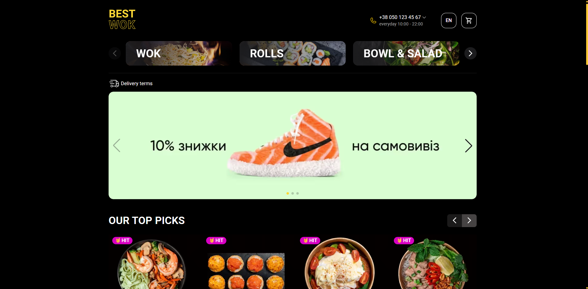
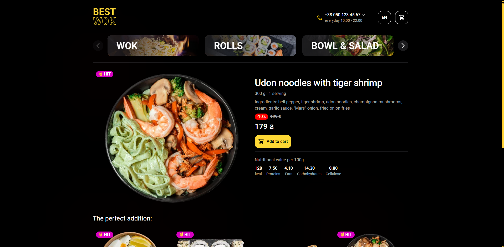
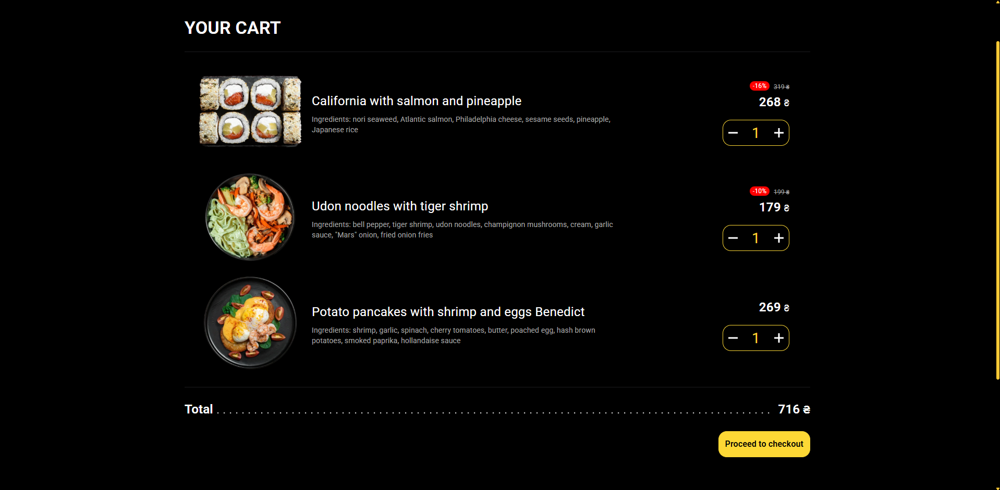
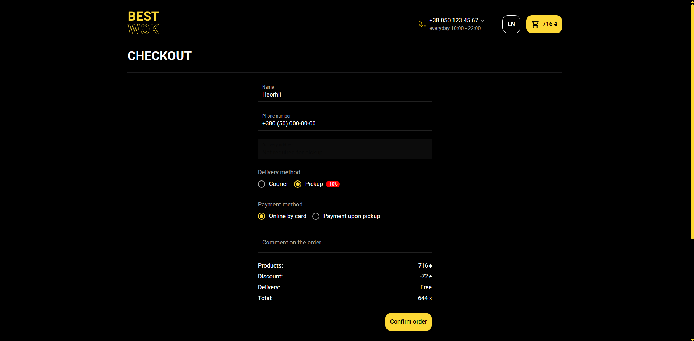

# Best-Wok

**Best-Wok** is a web application for an online restaurant that allows users to build a cart and place orders with a choice of delivery and payment methods.

## Live Demo

https://best-wok.onrender.com/

Note: The backend is hosted on [Render](https://render.com/) with a free plan.
This means the server may enter sleep mode after a period of inactivity, leading to a cold start.
As a result, the first request can take up to 30–60 seconds to respond.
Please wait patiently, the app will work normally after the initial load.

## Tech Stack

### Frontend

- **React**

- **Material UI (MUI)** — UI components

- **Redux Toolkit** — state management

- **React Router DOM** — routing

- **React Hook Form** — form handling

- **Motion** — animations

- **Swiper** — sliders & carousels

- **i18next** — internationalization (i18n)

- **Leaflet & React-Leaflet** — maps and geolocation

### Backend

- **Node.js**

- **Express.js**

- **MongoDB Atlas**

### Tooling & Deployment

- **Vite**

- **Render**

## Screenshots

### Home page



### Product page



### Cart page



### Checkout page



## Getting Started

### 1. Clone the Repository:

```bash
git clone https://github.com/Bankai-NWC/Best-wok.git
cd Best-wok
```

### 2. Install Dependencies:

```bash
cd /client
npm install
```

```bash
cd ../server
npm install
```

### 3. Set Up Environment Variables:

Create `.env` files for both the client and the server using the `.env.local.example` or `.env.local.production` files as templates.

### 4. Start Development Servers:

Frontend:

```bash
cd client
npm run dev
```

Backend:

```bash
cd server
npm run dev
```